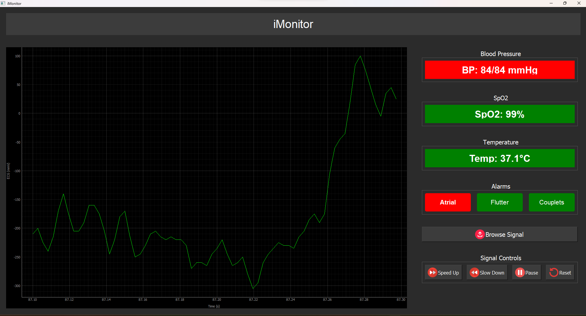
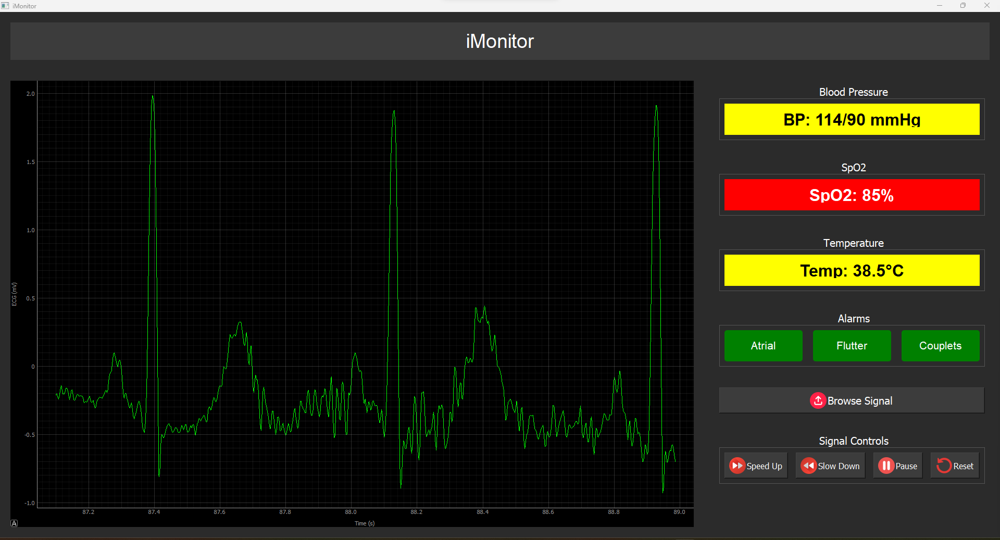

# iMonitor

## **Overview**  
**iMonitor** is a **patient monitoring GUI** designed to display and monitor essential vital signs in real time. It provides healthcare professionals with critical insights by continuously tracking patient data and detecting life-threatening arrhythmias. The system includes visual alarms and automated email notifications to alert medical staff, ensuring timely intervention and improving patient outcomes.  

## **Features**  
✔️ **Real-time Monitoring**: Continuously displays vital signs, including:  
- **ECG (Electrocardiogram)**  
- **Blood Pressure**  
- **SpO₂ (Oxygen Saturation)**  
- **Body Temperature**  

✔️ **Arrhythmia Detection**: Identifies and alerts medical staff about:  
- **Atrial Fibrillation**  
- **Atrial Flutter**  
- **Ventricular Couplets**  

✔️ **Alert System**:  
- **Visual Alarms**: Immediate on-screen alerts for abnormal readings.  
- **Email Notifications**: Sends automated alerts to medical staff for critical conditions.  

## **Technologies Used**  
- **Programming Language**: [Python]  
- **GUI Framework**: [PyQt6]  
- **Signal Processing Libraries**: [SciPy, NumPy]  
- **Email Notification System**: [SMTP]  

---

## **How It Works**  
1. The software receives real-time patient data from medical sensors.  
2. It processes the signals and displays vital parameters in an intuitive GUI.  
3. The system analyzes ECG data to detect abnormal rhythms.  
4. If a critical condition is detected, the system triggers a **visual alarm** and sends an **email notification** to the medical team.  
5. **User Controls**: The GUI provides interactive control buttons for signal management, including:  
   - **Play**: Start displaying real-time signals.  
   - **Pause**: Temporarily halt signal display.  
   - **Increase Speed**: Speed up the signal playback.  
   - **Decrease Speed**: Slow down the signal playback.  
   - **Reset**: Restore signal playback to its default state.  
---
## **Preview**

## Contributors 
<table>
  <tr>
    <td align="center">
    <a href="https://github.com/Youssef-Abo-El-Ela" target="_black">
    
     
    <b>Youssef Aboelela</b></a>
    </td>
    <td align="center">
    <a href="https://github.com/Anasmo1323" target="_black">
    
     
    <b>Anas Mohamed</b></a>
    </td>
    <td align="center">
    <a href="https://github.com/aliyounis33" target="_black">
    
     
    <b>Ali Younis</b></a>
    </td>
    <td align="center">
    <a href="https://github.com/louai111" target="_black">
    
     
    <b>Louai Khaled</b></a>
    </td>
    <td align="center">
    <a href="https://github.com/omarkhaled235" target="_black">
    
     
    <b>Omar Khaled</b></a>
    </td>
      </tr>